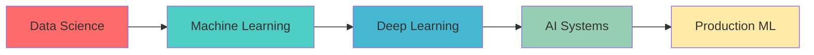

# 🧠 System.initialize("AI_Engineer") 
> *Building intelligent systems that shape tomorrow's possibilities*

```python
class AIEngineer:
    def __init__(self):
        self.name = "Deepak Thirukkumaran"
        self.role = "AI Engineer"
        self.passion = ["Machine Learning", "Computer vision", "Deep Learning", "AI]
        self.status = "Currently optimizing the future 🚀"
    
    def get_expertise(self):
        return {
            "primary_stack": ["Python", "TensorFlow", "PyTorch", "Docker"],
            "specialization": ["Deep Learning", "MLOps", "Computer Vision"],
            "tools": ["Azure", "AWS", "Git"],
        }
```

## 🎯 Mission Statement
Architecting AI solutions that bridge the gap between complex algorithms and real-world impact. Every model I build is a step toward making artificial intelligence more accessible and beneficial for humanity.

## 🔬 Current Experiments
- 🧪 **Project Alpha**: Developing next-gen recommendation systems
- 🎨 **Creative AI**: Exploring generative models for artistic applications  
- 🔍 **Research**: Contributing to open-source ML libraries
- 📊 **DataViz**: Building intelligent data visualization tools

## 🛠️ Tech Arsenal


## 📈 Impact Metrics
- 🤖 **AI Models Deployed**: 15+ production systems
- 📚 **Open Source Contributions**: Active in ML community
- 🎓 **Knowledge Sharing**: Technical blogs & tutorials
- 🌟 **Community**: Mentoring emerging AI developers

## 🌐 Neural Network
[](your-linkedin)
[](your-twitter)
[](your-website)
[](mailto:your-email)

## 💭 Philosophy
*"The best AI doesn't replace human intelligence—it amplifies it."*

---

### 📊 GitHub Analytics


### 🏆 Achievement Unlocked


---

<div align="center">
  
**💡 "Every commit is a step toward artificial general intelligence"**

*Let's build the future together, one algorithm at a time*

</div>
